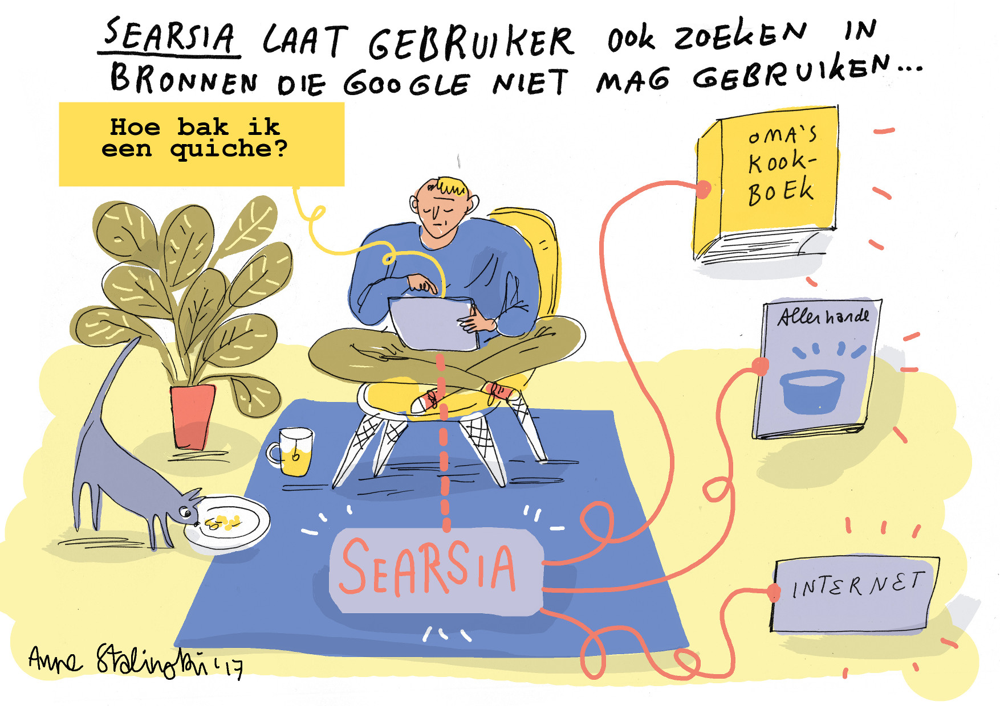

The Dutch chapter of ISOC asked the great Anne Stalinksi to make a
cartoon of Searsia.
Translated to English, the cartoon says: "Searsia allows users to search
sources that Google cannot use".
The user enters the query "How to bake a quiche?", and Searsia not only
searches the "Internet", but
also the infamous "grandma's cookbook" and "sundry".

Anne Stalinski is de _nom de plume_ of illustrator,
cartoonist and drafter Anne Staal. Her motto:
"Don't whine, color!" (Dutch: "Niet zeuren maar kleuren!"). 
Anne worked amongst others for City of
Talent, IDFA, Studio de Leijer, and the Frankfurter Buchmesse.
More information at: [https://annestalinski.myportfolio.com](https://annestalinski.myportfolio.com)
