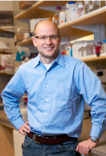

# Dr. Christian Steidl, MD

<CSteidl@bccancer.bc.ca>  
Tel: 604-675-8046  
Fax: 604-675-8183  
675 West 10th Ave, Vancouver BC, V5Z 1L3

### Research Role

- Research Scientist
- Assistant Professor, Department of Pathology and Laboratory Medicine (University of British Columbia)

### Education

- M.D., University of Muenster Medical School, 2001
- Doctorate (Pathology), University of Witten/Herdecke, 2003

### Research Interests

The research of my laboratory focuses on the molecular characterization of lymphoid cancers and biomarker discovery in a variety of Hodgkin and Non-Hodgkin Lymphoma subtypes.  Our translational lymphoma research group uses a variety of state-of-the-art genome-wide discovery tools including array-based and digital gene expression profiling, single-nucleotide polymorphisms ananlysis and massively parallel sequencing techniques.  A main research goal of the lab is to identify and functionally study underlying genetic mechanisms of immune privilege in lymphoid cancers.  In previous work using next generation sequencing, we identified several driver mutations and gene fusions, in particular, that have been shown to arise from specific chromosomal rearrangements in Hodgkin lymphoma and primary mediastinal large B cell lymphoma.  Most of the identified genes (CIITA, CD274, PDCD1LG2) feature prominently in immune cell function impacting non-neoplastic cells in the tumor microenvironment.  The discovery of these changes across a wide spectrum of lymphomas will likely  reinforced the paradigm that immune privilege is a critical component of cancer phenotypes.

Another focus of the laboratory is on the specific composition of the tumor microenvironment in Hodgkin lymphoma.  Using gene expression profiling and immunohistochemistry we have identified that the number of tumor-associated macrophages in lymph node biopsies is linked to unfavorable treatment outcome.  However, many questions remain regarding the molecular mechanisms underlying the interaction of the malignant cells with infilatrating macrophages and immune cells in the microenvironment in general.  Recently, CSF1R has been identified as a key molecule expressed on Hodgkin Reed Sternberg (HRS) cells and tumor-associated macrophages in Hodgkin lymphoma.  We now seek to better describe the phenotype of tumor-associate macrophages found in lymphoma biopsies to shed more light on this tumor-microenvironment interaction and to test in-vitro if this cross-talk can be targeted by small molecule inhibitors.

Lymphoma relapse and progression is still one of the major clinical challenges in clinical care and our knowledge about the underlying biology of relapse is still rudimentary.  Our preliminary data indicate that certain gene findings have developed during treatment and might be characteristic of this relapse biology.  Therefore, we specifically focus in ongoing translational studies on lymphoma relapse biopsies using highly-annotated clinical data sets.  By collaboration with our clinical colleagues we are working on solutions how to develop better outcome predictors and poredictive biomarkers that inform on individualized treatment options.  These studies encompass biomarker evalutation in Hodgkin lymphoma, follicular lymphoma, large B cell lymphomas, and mantle cell lymphoma.

### Collaborations

As a translational research laboratory we pursue the goal of translating our research findings into better treatments for our patients.  The Centre for Lymphoid Cancer (CLC) provides an excellent infrastructure to answer clinically relevant questions in collaboration with clinical oncologists (Joseph Connors, Laurie Sehn, Kerry Savage), hemato-pathologists (Randy Gascoyne), genome researchers (Marco Marra) and computational biologists (Sohrab Shah).  The Centre for Translational and Applied Genomics (CTAG) and the Genome Sciences Centre (GSC) is providing cutting technology to facilitate translational research from bench to bedside.  Multiple collaborations with researchers inside and outside the Cancer Agency complement the research focus areas to provide additional expertise in epigenomics (Martin Hirst) in vivo modeling (Steidl lab, Einstein College, NY), endogenous retroviruses and epigenetics (Mager lab, Terry-Fox Laboratory, BCCA), immune pathology (Anke van den Berg, Arjan Diepstra, University of Groningen, NL), and childhood lymphomas (Horton lab, Baylor College, Houston, TX).

Visit the [Steidl Lab website](http://steidllab.med.ubc.ca/)!
